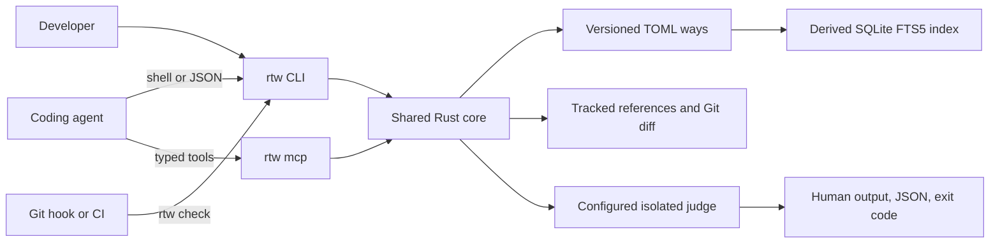

<p align="center">
  
</p>

<h1 align="center">Right This Way</h1>

<p align="center"><strong>Proven repository patterns for coding agents.</strong></p>

<p align="center">
  <a href="#quick-install-with-your-agent">Quick Install</a> |
  <a href="#getting-started">Getting Started</a> |
  <a href="#retrieval">Retrieval</a> |
  <a href="#integrations">Integrations</a> |
  <a href="#benchmarks">Benchmarks</a>
</p>

<p align="center">
  <a href="https://github.com/lucasrgt/right-this-way/actions/workflows/ci.yml"></a>
  <a href="https://github.com/lucasrgt/right-this-way/releases"></a>
  <a href="LICENSE"></a>
  
  
</p>

Coding agents can reproduce syntax. They are less reliable at preserving a
repository's real implementation patterns across distant features, long tasks,
different agents, and context compaction.

Right This Way records a proven repository pattern once, retrieves it before
analogous work, and audits the finished diff for concrete deviations. The
agent does not have to remember where the previous implementation lived.

```text
A proven pattern exists -> rtw add
A task is starting      -> rtw guide
Work is finishing       -> rtw check
```

<table>
<tr><td><b>One durable concept</b></td><td>A way describes a reusable implementation pattern already proven by tracked repository code.</td></tr>
<tr><td><b>Repository-owned precedent</b></td><td>Readable TOML ways travel through Git with the team. References point back to the working implementation.</td></tr>
<tr><td><b>Cross-directory retrieval</b></td><td>Scopes, tags, and SQLite FTS5 find a relevant pattern even when analogous work lives in another feature tree.</td></tr>
<tr><td><b>Bounded context</b></td><td>Agents receive only the highest-ranked ways and inspect their references instead of loading the complete corpus.</td></tr>
<tr><td><b>Fail-closed alignment</b></td><td>A two-stage isolated judge must confirm the same way, changed path, and line before reporting a deviation.</td></tr>
<tr><td><b>Language and agent independent</b></td><td>Any Git codebase and any shell or MCP-capable agent can use the same native binary.</td></tr>
</table>

RTW is positive repository memory. It answers one durable question:

> How does this repository already implement this kind of thing correctly?

---

## Quick install with your agent

Copy this prompt into any coding agent with terminal access:

```text
Set up Right This Way in this Git repository.

Download the latest stable binary for this machine from
https://github.com/lucasrgt/right-this-way/releases and verify its published
SHA256SUMS entry. Use no third-party package and do not build from source.

Install `rtw` in a user-local PATH location without administrator access or
adding runtime dependencies to the repository. Confirm with `rtw --version`.

At the repository root, run `rtw init --agent-file AGENTS.md`. If CLAUDE.md,
GEMINI.md, or another tracked agent instruction file is actively used, pass
one additional `--agent-file` option for each applicable file. Preserve all
existing content.

Read `.rtw/SKILL.md`. Confirm that `.rtw/ways/` is versioned while
`.rtw/config.local.toml` and `.rtw/index.sqlite` are ignored. Run:

rtw guide \
  --task "Adopt Right This Way" \
  --path AGENTS.md

Do not invent initial ways. Add a way only when a reusable pattern is already
proven by tracked repository files. Do not commit, push, or modify unrelated
files. Report the installed version, changed files, active judge command, and
any action still required.
```

### Manual installation

Linux and macOS:

```bash
curl -fsSL https://raw.githubusercontent.com/lucasrgt/right-this-way/main/scripts/install.sh | sh
```

Windows PowerShell:

```powershell
irm https://raw.githubusercontent.com/lucasrgt/right-this-way/main/scripts/install.ps1 | iex
```

Build from source:

```bash
cargo install --git https://github.com/lucasrgt/right-this-way --locked
```

RTW is one native binary. It requires no hosted service, daemon, Node runtime,
Python runtime, or project-language integration.

---

## Getting started

Initialize a Git repository and connect the skill to the instruction files its
agents actually read:

```bash
rtw init \
  --agent-file AGENTS.md \
  --agent-file CLAUDE.md
```

Record an existing feature view-model pattern:

```bash
rtw add \
  --title "Feature view models" \
  --intent "Create a view model for a feature workflow" \
  --guidance "Keep state transitions in the view model and expose immutable state to the view." \
  --scope "src/features/**" \
  --tag "view-model" \
  --tag "state-management" \
  --reference "src/features/orders/order_view_model.dart"
```

Guide analogous work before editing:

```bash
rtw guide \
  --task "Create the payment feature view model" \
  --path "src/features/payments/payment_view_model.dart"
```

The result identifies the relevant way and the proven files the agent must
inspect:

```text
> Feature view models [state-management, view-model]
  Keep state transitions in the view model and expose immutable state to the view.
  References: src/features/orders/order_view_model.dart
```

Audit the final uncommitted diff:

```bash
rtw check --task "Create the payment feature view model"
```

Audit committed branch work before a pull request or push:

```bash
rtw check \
  --base origin/main \
  --task "Review the payment feature"
```

### The flexible task loop

| Moment | Command | Result |
| --- | --- | --- |
| Task start | `rtw guide --task "<goal>" --path <expected-path>` | Relevant ways and references enter the working context |
| Scope change or context reset | Rerun `rtw guide` | The agent is reheated with patterns for the new scope |
| A reusable implementation becomes proven | `rtw add` | The pattern becomes versioned team knowledge |
| Task review or pre-commit | `rtw check --task "<completed task>"` | The working tree is audited against relevant ways |
| Pull request, review, or pre-push | `rtw check --base <target> --task "<context>"` | Committed branch work is audited against its comparison base |
| Any later useful checkpoint | Rerun `guide` or `check` | RTW remains useful outside one fixed harness lifecycle |

`guide` and `check` are intentionally repeatable. Run them again when the task,
expected paths, implementation scope, context, or reviewed diff changes.

### Exit codes

| Code | Meaning | Required action |
| --- | --- | --- |
| `0` | Relevant ways were retrieved or the reviewed work is aligned | Continue |
| `1` | Confirmed pattern deviations were found | Align the implementation and rerun |
| `2` | Repository, configuration, judge, protocol, or audit failure | Treat the audit as incomplete |

Provider and protocol failures never produce a passing audit.

---

## The way model

RTW has one durable concept:

> A way is a reusable implementation pattern backed by tracked repository code.

```toml
schema = 1
id = "01k..."
title = "Feature view models"
intent = "Create a view model for a feature workflow"
guidance = "Keep state transitions in the view model and expose immutable state to the view."
scopes = ["src/features/**"]
tags = ["state-management", "view-model"]
references = ["src/features/orders/order_view_model.dart"]
recorded_at = "2026-07-26T12:00:00Z"
recorded_by = "Ana Developer"
recorded_commit = "9e8d..."
```

A useful way answers four questions:

| Question | Field |
| --- | --- |
| When should this pattern apply? | `intent` |
| Which structure or invariants matter? | `guidance` |
| Where is analogous work likely to happen? | `scopes` and `tags` |
| Which existing implementation proves it? | `references` |

### What belongs in a way

| Record | Do not record |
| --- | --- |
| A recurring implementation shape used successfully in the repository | A generic industry best practice |
| A pattern with one or more tracked reference files | A hypothetical architecture with no implementation |
| Guidance that preserves important structure and invariants | A complete copy of the reference source |
| Reusable scopes and semantic tags | A one-off workaround or temporary experiment |
| Proven local conventions agents routinely need to reproduce | Personal preferences or speculative rules |

If the repository does not already contain a proven reference, the proposed
pattern is not a way yet.

---

## Retrieval

`rtw guide` combines independent deterministic signals:

| Signal | Priority | Example |
| --- | --- | --- |
| Scope | Highest | `src/features/**` matches a new payment feature |
| Exact tag | High | `view-model` transfers across unrelated feature directories |
| Full text | Supporting | Task language overlaps title, intent, guidance, or tags |

The default result limit is eight and can be adjusted up to 50. `rtw check`
independently retrieves at most 12 ways from the actual changed paths. The full
corpus never needs to enter the agent's context.

### Versioned truth and disposable index

```text
.rtw/
  config.local.toml
  config.toml
  SKILL.md
  ways/
    <ulid>.toml
  index.sqlite
```

| Artifact | Role | Versioned |
| --- | --- | --- |
| `.rtw/ways/*.toml` | Durable, human-readable repository patterns | Yes |
| `.rtw/SKILL.md` | Agent operating protocol | Yes |
| `.rtw/config.toml` | Optional shared judge command | Only by deliberate team choice |
| `.rtw/config.local.toml` | Developer-local judge command | No |
| `.rtw/index.sqlite` | Derived SQLite FTS5 projection | No |

The index contains no unique knowledge. RTW fingerprints the serialized TOML
corpus and reuses the index only while the fingerprint matches. Direct edits,
Git updates, a missing file, or a corrupt database trigger an automatic
transactional rebuild.

SQLite FTS5 searches `title`, `intent`, `guidance`, and `tags`. RTW retrieves
the complete internal FTS match set before bounded ranking, so an early global
cutoff cannot silently discard the correct scoped result from a large tie.

---

## Alignment checking

Deterministic retrieval decides which ways are relevant. Semantic alignment
still depends on the configured judge because repository patterns cannot be
reduced to one universal linter.

`rtw check` constrains that judgment:

1. Resolve changed paths and the Git diff from the selected base.
2. Retrieve at most 12 relevant versioned ways.
3. Supply only those ways, changed paths, and diff lines to an isolated judge.
4. Require the first pass to name a concrete way, path, line, and reason.
5. Ask a second isolated pass to confirm the same claimed deviation.
6. Reject invented way IDs, unchanged paths, invalid lines, malformed output,
   judge failures, and unsupported configuration.

The current diff input is bounded at 120,000 bytes. An oversized or non-text
untracked change fails the audit instead of being silently omitted.

### Deterministic guarantees and model judgment

| Deterministic RTW behavior | Model-dependent judgment |
| --- | --- |
| Rank ways from scope, tags, and complete FTS matches | Decide whether changed code violates the supplied guidance |
| Limit the context without truncating the selected ways | Interpret repository-specific intent and implementation detail |
| Validate way IDs, changed paths, lines, and reasons | Distinguish a valid adaptation from an inconsistent deviation |
| Require independent confirmation | Produce stable semantic conclusions across repeated executions |
| Fail closed on process or protocol errors | Avoid every possible false positive or false negative |

RTW improves the evidence and protocol around the model. It does not claim
that every model will interpret every repository pattern perfectly.

Structured output is available for hooks, CI, and harnesses:

```bash
rtw guide \
  --task "Create the payment feature view model" \
  --path src/features/payments/payment_view_model.dart \
  --json

rtw check \
  --base origin/main \
  --task "Review the payment feature" \
  --json
```

---

## Configuration

`rtw init` creates an ignored developer-local configuration:

```toml
schema = 1

[judge]
command = [
  "codex",
  "exec",
  "--skip-git-repo-check",
  "--sandbox",
  "read-only",
  "-"
]
```

Configuration precedence:

| Priority | Scope | Location |
| ---: | --- | --- |
| 1 | Repository-local developer override | `.rtw/config.local.toml` |
| 2 | Optional team override | `.rtw/config.toml` |
| 3 | Linux and macOS user | `~/.config/right-this-way/config.toml` |
| 3 | Windows user | `%APPDATA%\right-this-way\config.toml` |

One teammate can use Codex while another uses Claude or an internal evaluator
without changing versioned project policy. Commit `.rtw/config.toml` only when
the team intentionally standardizes one command.

The judge command reads one UTF-8 audit prompt from standard input and writes
only the requested JSON object to standard output. The process runs without a
shell, so arguments remain explicit.

---

## Integrations

| Surface | Role | Required |
| --- | --- | --- |
| Native CLI | Universal interface for agents, humans, hooks, CI, and scripts | Yes |
| `.rtw/SKILL.md` | Teaches when to guide, add, and check | Created by `rtw init` |
| Agent instruction block | Activates the skill from harness files | Created by `rtw init` |
| Local stdio MCP | Exposes the same three operations as typed tools | Optional |
| Git hook | Provides fast local alignment feedback | Optional |
| CI | Enforces a final comparison-base audit | Optional |

### MCP

Start the local stdio server:

```bash
rtw mcp
```

Generic MCP host configuration:

```json
{
  "mcpServers": {
    "right-this-way": {
      "command": "rtw",
      "args": ["mcp"]
    }
  }
}
```

| Tool | Purpose |
| --- | --- |
| `rtw_guide` | Retrieve relevant proven repository patterns |
| `rtw_add` | Record one reference-backed way |
| `rtw_check` | Audit a Git diff against relevant ways |

Every MCP tool requires an explicit repository root and calls the same Rust
core as the CLI. MCP does not expose generic file, SQL, prompt, or memory tools.

### Hooks and CI

An ordinary pre-push hook can audit committed branch work:

```bash
rtw check \
  --base origin/main \
  --task "Pre-push pattern alignment"
```

For CI, install a pinned release binary, configure an ephemeral approved judge,
and run the same command against the pull request base. Judge credentials and
provider configuration stay outside the repository.

---

## Security and privacy

Right This Way is local-first:

1. Versioned ways remain inside the Git repository.
2. The ignored SQLite database is a disposable local projection.
3. No hosted RTW account, daemon, or central pattern service is required.
4. Only retrieved ways and the bounded changed diff enter an alignment audit.
5. Malformed output, invented evidence, process failures, and invalid
   configuration fail closed.

The configured judge may send the bounded audit prompt to a cloud model. Teams
should select a judge compatible with their privacy, security, and data
residency requirements. A local model or approved internal gateway can
implement the same standard-input and JSON-output contract.

---

## RTW, NYA, and AVP

The projects are independent and solve different problems:

| Project | Durable question | Durable concept |
| --- | --- | --- |
| Right This Way | How does this repository already implement this kind of thing correctly? | Proven way |
| [Not You Again](https://github.com/lucasrgt/not-you-again) | Which corrected failure must not recur? | Scar |
| [Acceptance Verification Protocol](https://github.com/lucasrgt/acceptance-verification-protocol) | Which observable behavior must hold? | Acceptance criterion |

RTW is positive precedent. NYA is corrected-failure memory. AVP is executable
acceptance. They complement one another without sharing storage, configuration,
or runtime dependencies.

---

## Benchmarks

RTW publishes reproducible protocols, machine-readable summaries, exact diffs,
candidate hashes, and agent event logs.

### Paired coding-agent benchmark

Five repository-pattern tasks were run with and without RTW using isolated
agents and a pinned candidate:

| Arm | Tasks passed | Pattern deviations | RTW workflow observed |
| --- | ---: | ---: | ---: |
| Baseline | 5 of 5 | 0 | Not applicable |
| RTW | 5 of 5 | 0 | 5 of 5 guide and check pairs |

The measured result is a tie with zero regressions and zero demonstrated
improvements. The baseline already reproduced every intentionally visible
pattern, so the run does not provide causal improvement evidence. It confirms
that RTW was used and did not degrade those five tasks.

Read the [paired report](benchmarks/results/v0.1.1-paired-gpt-5.3-codex-spark/REPORT.md)
and [machine-readable summary](benchmarks/results/v0.1.1-paired-gpt-5.3-codex-spark/summary.json).

### Large-corpus stress benchmarks

| Corpus | Recall probes | Target ranked first | Unrelated probes empty | Warm recall p95 | Alignment controls |
| ---: | ---: | ---: | ---: | ---: | --- |
| 1,024 ways | 128 | 128 of 128 | 8 of 8 | 0.125 s | Exact deviation found, corrected control clean |
| 10,000 ways | 64 | 64 of 64 | 8 of 8 | 0.594 s | Exact deviation found, corrected control clean |

Cold index construction was measured separately at 8.156 seconds for 1,024
ways and 68.141 seconds for 10,000 ways. Warm retrieval reuses the corpus
fingerprint and disposable SQLite projection.

The first 10,000-way development attempt exposed an early global FTS cutoff
that ranked one target second. Version 0.1.1 removed that cutoff and added a
permanent regression test covering more than 64 tied FTS matches.

Read the [1,024-way report](benchmarks/results/v0.1.1-stress-1024/REPORT.md),
[10,000-way report](benchmarks/results/v0.1.1-stress-10000/REPORT.md), and
[benchmark protocols](benchmarks/README.md).

These benchmarks prove the measured retrieval, bounds, and controls at those
corpus sizes. They do not claim universal model accuracy or that every
repository will benefit equally from every recorded way.

---

## Architecture



CLI and MCP are thin adapters over the same core operations. The embedded
skill teaches the workflow but does not own persistence or enforcement. See
[`ARCHITECTURE.md`](ARCHITECTURE.md) for the normative runtime design.

### Repository layout

```text
right-this-way/
  src/                         Rust CLI, MCP, storage, retrieval, and audit
  tests/                       Black-box, protocol, and regression tests
  xtask/                       Canonical repository quality gate
  benchmarks/                  Paired-agent and large-corpus protocols
  assets/right-this-way/       Portable agent skill
  scripts/                     Release installers
  .github/workflows/           CI and release packaging
```

---

## Scope

| Right This Way does | Right This Way does not |
| --- | --- |
| Preserve proven repository-specific implementation patterns | Store generic knowledge or personal preferences |
| Retrieve patterns across directories through scopes and tags | Copy the entire pattern corpus into every prompt |
| Point agents to tracked reference implementations | Generate a new architecture with no precedent |
| Audit concrete deviations in changed code | Perform open-ended AI code review |
| Work with any language through Git paths and text diffs | Replace tests, linters, typecheckers, NYA, or AVP |
| Support CLI, skills, scripts, hooks, CI, and MCP | Require a hosted service or specific agent harness |

---

## Build and contribute

Build the native binary with the stable Rust toolchain:

```bash
cargo build --release
```

Run the permanent repository gate:

```bash
cargo install cargo-llvm-cov tokei --locked
cargo xtask verify
```

`cargo xtask verify` is the canonical gate for local work, coding agents, CI,
and releases.

| Invariant | Gate |
| --- | --- |
| Maintained production code | At most 500 lines |
| Shared runtime line coverage | At least 95 percent without rounding |
| Packaged entrypoint | End-to-end binary smoke |
| Product model | One way across three daily operations |
| Storage | Versioned TOML plus disposable SQLite |
| Failure behavior | Judge and protocol failures fail closed |
| Transport | CLI and MCP call the same core |

Contributions should preserve the one-way model, reference-backed provenance,
bounded retrieval, shared core, and fail-closed audit.

---

## License

Right This Way is available under the [MIT License](LICENSE).
